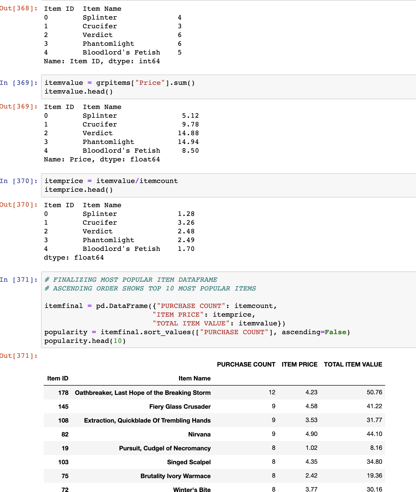

# Heroes_of_Pymoli
# Below is a preview: Pandas Programming

A personal favorite project, Heroes of Pymoli uses predetermined Big Data to immerse readers into a data driven, fantasy world. Using intermediate-advanced Python programming techniques, I program lines of code that separate the information into desired datasets, thereby answering questions suggested by the prompt.

-----------------------------------------------------------------------------------------------------------

-----------------------------
-----------------------------
-----------------------------
-----------------------------

